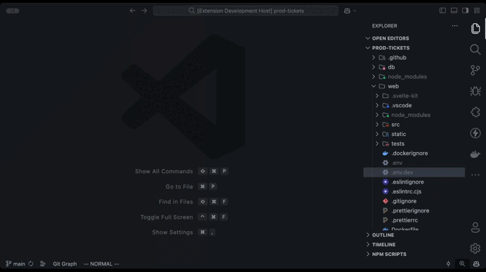

# Env Protector

## 🚀 Features

- **🔒 Toggle Visibility of Environment Files**: Easily toggle the visibility of environment files in the sidebar. This command modifies your workspace settings by adding `"**/.env*": true` to the `files.exclude` section in your `settings.json`.  
  
- **🛑 Confirmation Prompt Before Opening**: Prevent accidental exposure of sensitive data by receiving a confirmation prompt before opening an `.env` file. This safeguard adds an extra layer of security when handling critical environment variables.  
  
- **🤐 Mask Sensitive Data**: Automatically mask sensitive environment variables when viewing `.env` files. Variable values are replaced with asterisks, allowing you to review the structure of the file without compromising the actual data.  
  
- **➕ Add Environment Value Without Opening**: Insert new environment variables directly from the command palette without needing to open the `.env` file. This feature minimizes exposure risks while making it easy to update your environment.
  
- **✍️ Edit Environment Value Without Opening**: Quickly edit an existing environment variable from your enviroment files without exposing their contents in the editor.
  
- **➖ Remove Environment Value Without Opening**: Easily remove environment variables from your environment files, again without exposing their contents in the editor.
  

## 📦 Installation

You can install **Env Protector** either from the Visual Studio Code marketplace or manually using the steps below:

### Manual Installation

1. Download the `.vsix` file from the [releases page](https://github.com/sametcn99/env-protector/releases).
2. Open Visual Studio Code.
3. Navigate to the **Extensions** view by clicking the Extensions icon in the Activity Bar.
4. Click the ellipsis (...) in the top right corner of the Extensions view.
5. Select "Install from VSIX..." and choose the downloaded `.vsix` file.

## 👥 Contributing

Contributions are highly welcome! If you'd like to help improve **Env Protector**, please follow these steps:

1. Fork the repository to your own GitHub account.
2. Create a new branch for your feature or bug fix.
3. Make your changes and test them thoroughly.
4. Submit a pull request, describing your changes in detail.

Together, we can make **Env Protector** an even more valuable tool for the community!  
Thank you for your contributions!

## 📄 License

This project is licensed under the [GPL-3.0 license](LICENSE).
