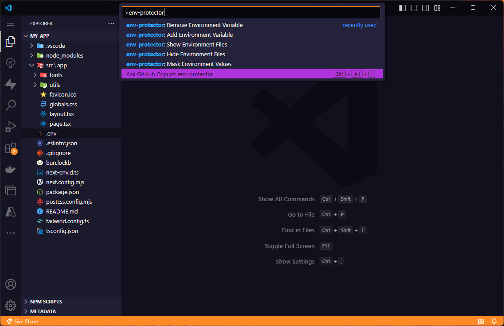
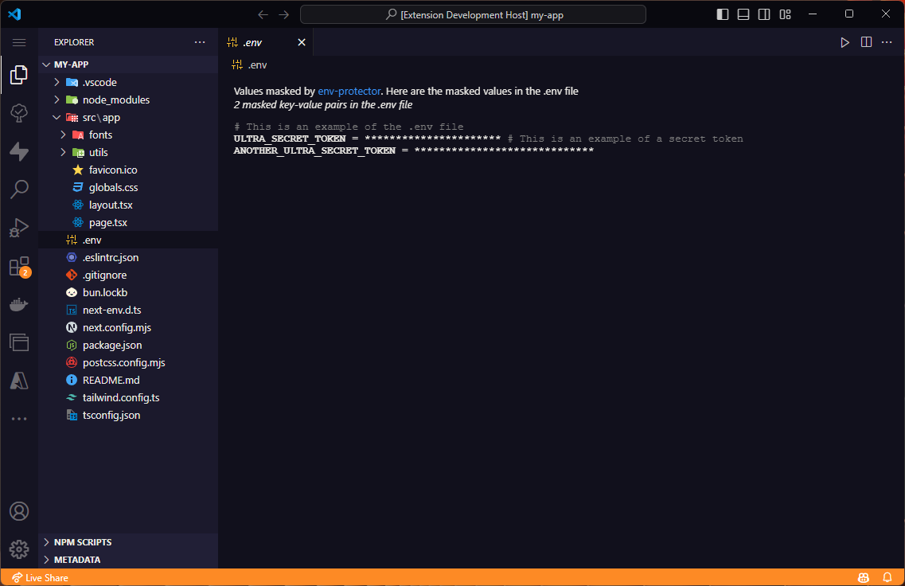
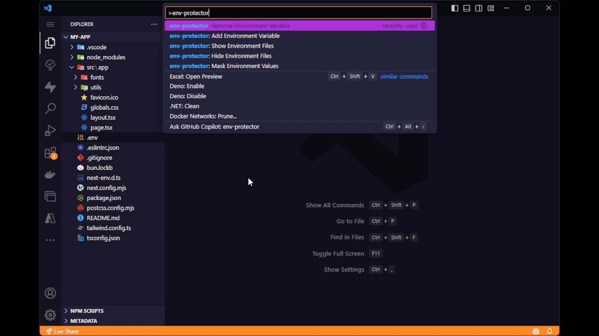

# Env Protector

## Features

- **Toggle Visibility**: Easily toggle the visibility of environment files in the sidebar. This command modifies your workspace settings by adding `"**/.env*": true` to the `files.exclude` section in your `settings.json`.  
  
- **Confirmation Prompt**: Prompts you to confirm before opening an environment file, preventing accidental exposure.  
  
- **Mask Sensitive Data**: Automatically masks sensitive environment variables in your environment files.  
  
- **Add Environment Value**: Add environment value without opening the env file.
  
- **Remove Environment Value**: Remove environment value without opening the env file.
  

## Manual Installation

1. Download the `.vsix` file from the releases page.
2. Open Visual Studio Code.
3. Navigate to the Extensions view by clicking the Extensions icon in the Activity Bar.
4. Click on the ellipsis (...) in the top right corner of the Extensions view.
5. Select "Install from VSIX..." and choose the downloaded `.vsix` file.

## Contributing

We welcome contributions to enhance the functionality of this extension. To contribute:

1. Fork the repository.
2. Create a new branch for your feature or bug fix.
3. Submit a pull request with a detailed description of your changes.

Thank you for your contributions!
